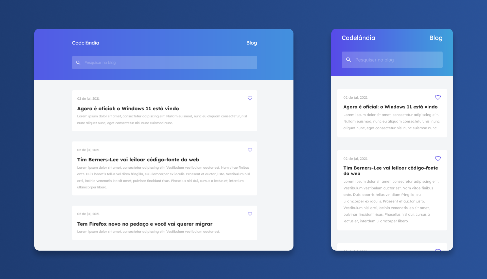

## Challenge 01 - Blog

---



## ⚙ Technologies

---

This project was developed using the following technologies:

- HTML5
- CSS3
- JavaScript

## 🚀 Getting started

---

Clone this project and acesss the folder.

```bash
$ git clone https://github.com/santos-vinicius/codelandia.git
$ cd desafios
$ cd desafio_01
```

## 🎨 Layout

---

You can view the project layout through the links below:

- [Layout](https://www.figma.com/file/Yb9IBH56g7T1hdIyZ3BMNO/Desafios---Codelândia?node-id=0%3A1)

by [Iuri Silva - iuricode](https://github.com/iuricode)

## 🪐 Deploy on Vercel

---

[Blog](https://desafio01-blog-pearl.vercel.app/)

---

> Made with ❤ and ☕ by [Vinicius Santos](https://github.com/santos-vinicius)
